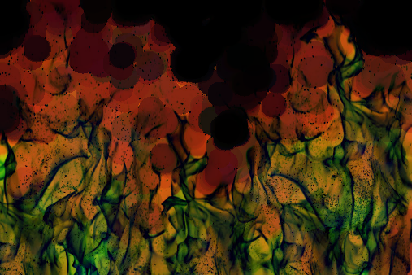

# Image Processing (Basic Operations)

In this simple, cute little program, I accomplished it using `numpy`, `tkinter`, and `opencv`. You can test your image and apply some basic processing operations to it.

## Features

### Smoothing Operations
- **Linear Blurring (Homogeneous Blur)**
- **Gaussian Filter**
- **Median Filter**
- **Bilateral Filter**

### Morphological Operations
- **Dilation**
- **Erosion**
- **Opening** (Erosion followed by Dilation)
- **Closing** (Dilation followed by Erosion)
- **Morphological Gradient Filter** (Difference between Dilation and Erosion)
- **Top Hat Filter** (Difference between an input image and its Opening)
- **Black Hat Filter** (Difference between the Closing and its input image)
- **Color Detector** (You can see it here: `morphological_operation/morphological_operation.ipynb/color_detector()`. It's a function, BTW)
- **Edge Filter** (Vertical and Horizontal)

### Zooming
- **Zoom Out**
- **Zoom In**

### Threshold Operations
- **Binary Filter**
- **Binary Inverted Filter**
- **Truncate**
- **Threshold to Zero Filter**
- **Threshold to Zero Inverted Filter**

## Usage

Load your image and manipulate it as much as you want. Then select a path and save it.

## Clarification Video

- **Loaded Image (Input):** 

- **Saved Image (Output):** 

- **Video:** 
<figure class="video_container">
 <video controls="true" allowfullscreen="true">
 <source src="Image Processing - Basic Operations.mp4" type="video/mp4">
 </video>
</figure>

